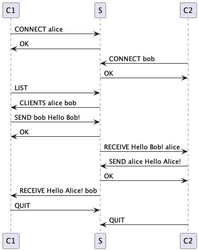
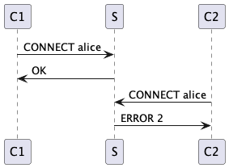
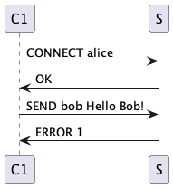
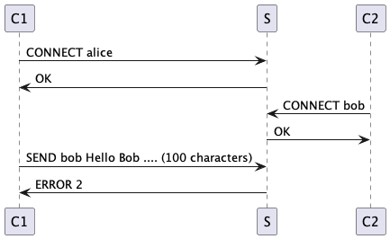

# The SMS protocol

You are working for a startup that wants to create a new communication app.

The app is simple: it allows users (with unique usernames) to send small text
messages (maximum 100 characters) to each other. The server is in charge of
sending the messages to the recipients.

You are asked to define the application protocol that will be used by the
clients and the server.

Here is **one of the possible results**.

> [!NOTE]
>
> Each person can have a different way to define the protocol. This is one of
> the possible ways to define the protocol. Your might be different and that is
> totally fine. The most important is to define the protocol in a clear and
> explicit way.

## Section 1 - Overview

The SMS (Short Message Service) protocol is a communication protocol that allows
the sending of text messages (generally short) between users.

## Section 2 - Transport protocol

The SMS protocol is a text message transport protocol. It must use the TCP
(Transmission Control Protocol) to ensure the reliability of data transmission
and must also use port 1234.

Every message must be encoded in UTF-8 and delimited by a newline character
(`\n`). The messages are treated as text messages.

The initial connection must be established by the client.

Once the connection is established, the client can send a text message to the
server indicating the message recipient.

The server must verify that the recipient is connected and that the message does
not exceed 100 characters.

If these conditions are met, the server sends the message to the recipient.

Otherwise, the server sends an error message to the client who sent the message.

On an unknown message, the server must send an error message to the client.

Once a client has disconnected, the server must close the connection.

## Section 3 - Messages

### Connection

The client sends a connection message to the server indicating the client's
username.

#### Request

```text
CONNECT <name>
```

- `name`: the name of the client

#### Response

- `OK`: the connection has been successfully established
- `ERROR <code>`: an error occurred during the connection. The error code is an
  integer between 1 and 1 inclusive. The error codes are as follows:
  - 1: the client's name is already in use

### Sending a message

The client sends a message to the server indicating the recipient of the
message. The server is then responsible for sending the message to the
recipient.

#### Request

```text
SEND <recipent> <message>
```

#### Response

- `OK`: the message has been successfully sent
- `ERROR <code>`: an error occurred while sending the message. The error code is
  an integer between 1 and 2 inclusive. The error codes are as follows:
  - 1: the recipient is not connected
  - 2: the message exceeds 100 characters

### Receiving a message

The server sends a message to the recipient indicating the sender of the
message. The client is then responsible for displaying the received message.

#### Request

```text
RECEIVE <message> <sender>
```

- `message`: the received message
- `sender`: the name of the message sender

#### Response

None.

### List connected clients

The client sends a message to the server to request the list of connected
clients.

#### Request

```text
LIST
```

#### Response

- `CLIENTS <client1> <client2> <client3> ...`: the list of connected clients.
  The clients are separated by a space.

### Disconnection

The client sends a message to the server to disconnect.

#### Request

```text
QUIT
```

#### Response

None.

## Section 4 - Examples

### Functional communication between a client and a server



### Communication between a client and a server with a duplicate client name



### Communication between a client and a server with an unconnected recipient



### Communication between a client and a server with a too long message


